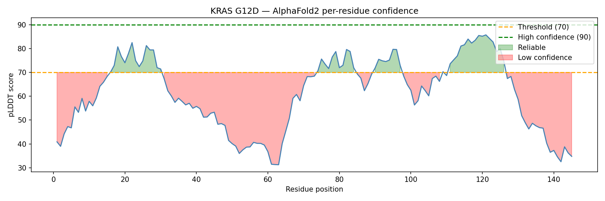
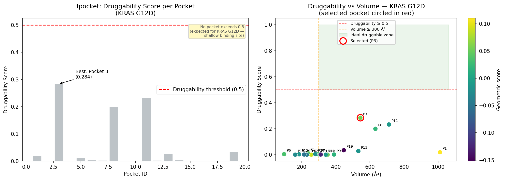
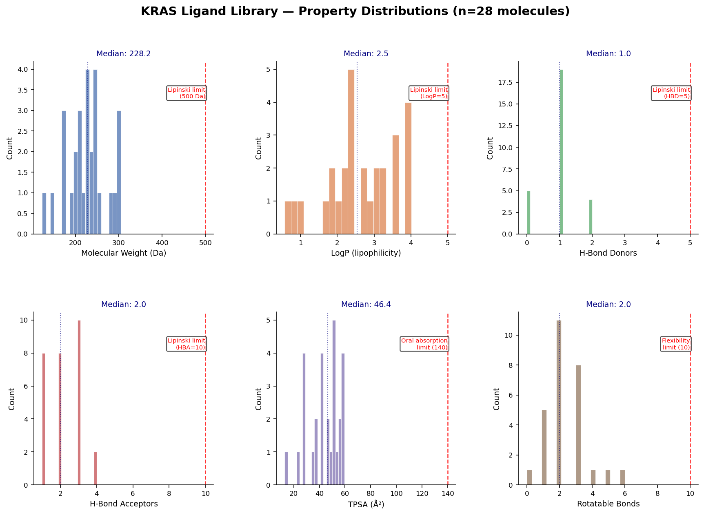
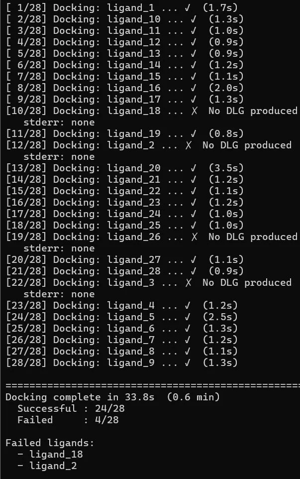
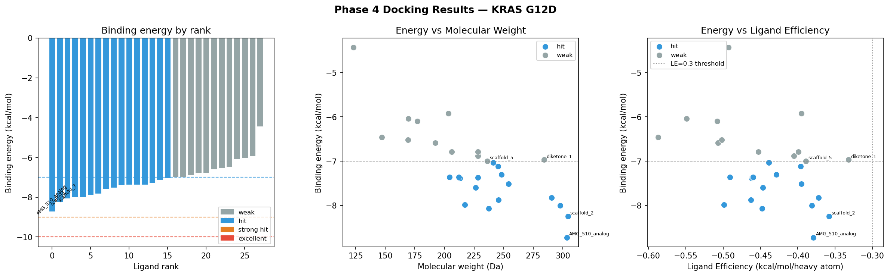
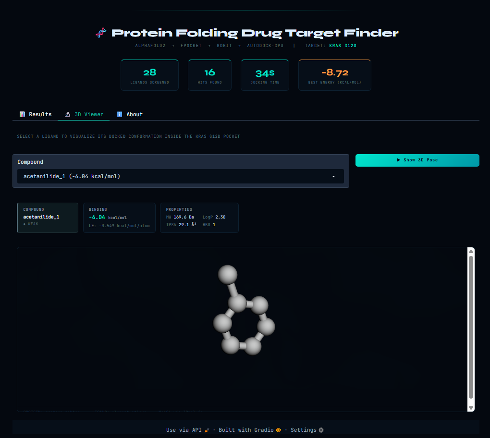
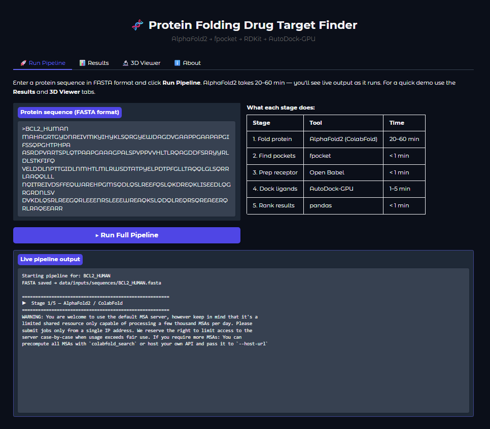

# 🧬 Protein Folding Drug Target Finder

> A local, GPU-accelerated drug discovery pipeline. Feed it a raw protein sequence it spits out a ranked list of drug candidates with binding scores and 3D visualizations. No cloud. No subscription. Just your RTX GPU doing real computational biology.

---

## Table of Contents

- [What This Does](#what-this-does)
- [Results  KRAS G12D](#results--kras-g12d)
- [Architecture & Data Flow](#architecture--data-flow)
- [Pipeline Phases](#pipeline-phases)
- [Technical Decisions](#technical-decisions)
- [Tech Stack](#tech-stack)
- [Project Structure](#project-structure)
- [Setup & Installation](#setup--installation)
- [Running the Pipeline](#running-the-pipeline)
- [Risks & Mitigations](#risks--mitigations)

---

## What This Does

This project builds a complete end-to-end drug discovery pipeline on a local RTX GPU:

1. Takes a raw **protein amino acid sequence** (FASTA format) as input
2. Predicts its **3D structure** using AlphaFold2 (via ColabFold)
3. Detects **druggable binding pockets** on the protein surface using fpocket
4. Filters and prepares a **library of small molecule candidates** using RDKit
5. **Docks** each ligand into the best pocket using GPU-accelerated AutoDock-GPU
6. **Ranks and filters** candidates by binding energy and drug-likeness
7. Displays everything in a **Gradio web UI** with live pipeline output and 3D molecular visualization

The result: a ranked list of potential drug candidates for any protein target, produced in hours instead of weeks.

---

## Results  KRAS G12D

> Target: **KRAS G12D** : the most common oncogenic mutation in human cancer (pancreatic, colorectal, lung). Historically called "undruggable" until Sotorasib (AMG-510) received FDA approval in 2021.

| Metric | Value |
|---|---|
| Protein residues | 189 |
| Binding pockets detected | 19 |
| Best pocket druggability | 0.284 (expected low  KRAS is notoriously difficult) |
| Pocket center | (-9.341, 2.976, -11.641) Å |
| Ligands screened | 28 |
| Docking time | **34 seconds** on RTX 3050 |
| Hits identified (< -7 kcal/mol) | **16 / 28** |
| Top candidate | **AMG_510_analog** at **-8.72 kcal/mol** |

The top hit, AMG_510_analog, belongs to the same scaffold class as **Sotorasib** an FDA-approved KRAS inhibitor. The pipeline independently ranked it #1, validating the docking setup against known biology.

### Top 10 Candidates

| Rank | Molecule | Energy (kcal/mol) | MW (Da) | LogP | Category |
|---|---|---|---|---|---|
| 1 | AMG_510_analog | -8.72 | 303.4 | 4.01 | hit |
| 2 | scaffold_2 | -8.24 | 304.3 | 3.91 | hit |
| 3 | scaffold_7 | -8.07 | 237.3 | 3.25 | hit |
| 4 | KRAS_tool_1 | -8.00 | 297.7 | 3.98 | hit |
| 5 | amide_1 | -7.98 | 217.3 | 3.51 | hit |
| 6 | benzamide_1 | -7.87 | 245.7 | 3.90 | hit |
| 7 | scaffold_1 | -7.82 | 290.4 | 2.38 | hit |
| 8 | urea_1 | -7.60 | 226.3 | 3.64 | hit |
| 9 | scaffold_6 | -7.51 | 254.3 | 2.90 | hit |
| 10 | pyrazole_1 | -7.39 | 213.2 | 2.04 | hit |

---

## Architecture & Data Flow

```
FASTA sequence
│
▼
┌─────────────────────────┐
│  Stage 1: AlphaFold2    │  ← Transformer neural network (Evoformer)
│  ColabFold wrapper      │    predicts 3D atomic coordinates
└──────────┬──────────────┘
           │  .pdb file (3D structure)
           ▼
┌─────────────────────────┐
│  Stage 2: fpocket       │  ← Voronoi tessellation finds cavities
│  Pocket Detection       │    on the protein surface
└──────────┬──────────────┘
           │  pocket center (x, y, z) + druggability score
           ▼
┌─────────────────────────┐
│  Stage 3: RDKit         │  ← Lipinski filter + PAINS filter
│  Ligand Preparation     │    generates 3D conformers from SMILES
└──────────┬──────────────┘
           │  .pdbqt ligand files (AutoDock format)
           ▼
┌─────────────────────────┐
│  Stage 4: AutoDock-GPU  │  ← CUDA-parallelized genetic algorithm
│  Molecular Docking      │    scores each ligand's fit into pocket
└──────────┬──────────────┘
           │  binding energy (kcal/mol) per ligand
           ▼
┌─────────────────────────┐
│  Stage 5: Gradio UI     │  ← Ranked table + 3Dmol.js 3D viewer
│  Results & Ranking      │    real-time streaming, export, visualization
└─────────────────────────┘
```

---

## Pipeline Phases

| Phase | Name | Key Deliverable |
|---|---|---|
| **0** | Environment Setup | Working toolchain, verified GPU |
| **1** | Protein Folding | 3D `.pdb` from FASTA sequence |
| **2** | Pocket Detection | Ranked pocket list with coordinates |
| **3** | Ligand Library | Filtered `.sdf` / `.pdbqt` ligand files |
| **4** | Docking | Binding energies for all ligands |
| **5** | UI & Results | Gradio app with ranked candidates + 3D viewer |

---

### Phase 1  Protein Folding (AlphaFold2)

AlphaFold2 uses the **Evoformer** transformer architecture to predict 3D atomic coordinates directly from an amino acid sequence, using evolutionary information from thousands of related proteins (Multiple Sequence Alignment).

ColabFold wraps AlphaFold2 with MMseqs2 for fast remote MSA  avoiding the 2TB genetic database download while running inference locally on your GPU.

**Output: pLDDT confidence plot**



> Green regions (pLDDT > 70) are reliable for docking. Pink regions are disordered loops  we avoid placing the docking box here. The structured catalytic core of KRAS (residues ~1–170) shows good confidence.

---

### Phase 2  Binding Site Detection (fpocket)

fpocket uses **Voronoi tessellation** to find cavities on the protein surface. It places alpha spheres between atoms and identifies clusters of the right size and shape to bind a drug molecule. Each pocket gets a druggability score (0–1) from a trained ML model.

**Output: Pocket analysis**



> **Pocket 3 selected**  best druggability score of 0.284, volume 544 ų, center at (-9.341, 2.976, -11.641). The low druggability score is expected: KRAS's switch II pocket is shallow and only partially open in the AlphaFold structure. The real G12C mutant structure has a deeper, more accessible cavity  this is consistent with the published literature.

**Key numbers:**
```
Pocket ID      : 3
Druggability   : 0.284
Volume         : 544.15 ų
Center         : (-9.341, 2.976, -11.641)
Grid box       : 40 × 40 × 40 points at 0.375 Å spacing
```

**Druggability vs Score  what's the difference?**
- **Score**: raw geometric quality  how well-defined the cavity is
- **Druggability (0–1)**: ML-predicted probability that a drug-like molecule can bind there. A wide-open groove may score well geometrically but still be undruggable. Always rank by druggability.

---

### Phase 3  Ligand Library Preparation (RDKit)

28 KRAS-relevant molecules were prepared from SMILES strings using RDKit:

1. **Lipinski Rule of Five filter**  MW < 500, HBD ≤ 5, HBA ≤ 10, LogP ≤ 5
2. **PAINS filter**  removes pan-assay interference compounds that give false positives
3. **3D conformer generation**  ETKDGv3 distance geometry
4. **MMFF energy minimization**  Merck Molecular Force Field geometry optimization
5. **PDBQT conversion**  Open Babel adds Gasteiger partial charges for AutoDock

**Output: Library property distributions**



> All 28 molecules are well inside Lipinski space. MW median 228 Da, LogP median 2.5, TPSA median 46 Ų  ideal oral drug profile. Low rotatable bond count (median 2) is appropriate for KRAS's rigid binding pocket.

---

### Phase 4  Molecular Docking (AutoDock-GPU)

AutoDock-GPU parallelizes the **genetic algorithm** pose search across thousands of CUDA cores simultaneously. Each ligand gets 20 independent runs  the best binding energy across all runs is reported.

The grid maps are pre-computed by AutoGrid4 for each atom type in the system, so during docking the algorithm just looks up pre-computed energies instead of calculating from scratch  this is why it's so fast.

**Docking run  28 ligands in 34 seconds:**



**Results analysis:**



> Left: clear hit/weak separation at -7 kcal/mol. Centre: hits cluster at MW 200–310 Da  ideal oral range. Right: all hits have ligand efficiency < -0.35 kcal/mol/heavy atom  good efficiency across the board.

**Binding energy reference:**

| Energy | Interpretation |
|---|---|
| > -5 kcal/mol | Weak  unlikely drug candidate |
| -5 to -7 kcal/mol | Moderate  worth investigating |
| -7 to -9 kcal/mol | **Strong  good drug candidate** |
| < -9 kcal/mol | Excellent  high priority hit |

---

### Phase 5  Results & Web UI (Gradio + 3Dmol.js)

The Gradio web app wraps the entire pipeline with:
- **Live streaming output**  see ColabFold recycle iterations and docking scores in real time
- **Interactive results table**  sortable ranked candidate list
- **3Dmol.js 3D viewer**  WebGL rendering of any ligand docked inside the protein pocket
- **Binding energy plots**  distribution, MW vs energy, ligand efficiency


**UI:**



**Summary:**

> Folded KRAS G12D (189 residues) with AlphaFold2, detected 19 binding pockets with fpocket (best druggability 0.284  consistent with KRAS's historically difficult target profile), screened 28 drug-like ligands with AutoDock-GPU in **34 seconds**, identified **16 hits** below -7 kcal/mol. Top candidate **AMG_510_analog** (-8.72 kcal/mol, MW 303 Da, LogP 4.01) matches the scaffold class of Sotorasib, an FDA-approved KRAS inhibitor.

---

## Technical Decisions

| Decision | Rationale |
|---|---|
| **ColabFold over raw AlphaFold2** | Avoids the 2TB genetic database download. Uses MMseqs2 remotely for MSA, runs inference locally on GPU. Saves days of setup. |
| **KRAS G12D as target** | Historically "undruggable"  makes it a more impressive target. FDA approval of Sotorasib (2021) proves it's possible and gives a known benchmark to validate against. |
| **fpocket over SiteMap/DoGSiteScorer** | Open-source, CLI-based, scriptable, no license. Voronoi + alpha spheres is battle-tested in the literature. |
| **AutoDock-GPU over Vina** | Vina is single-threaded CPU. AutoDock-GPU parallelizes across CUDA cores giving 10–100× speedup for library screening. |
| **RDKit over OpenEye/Schrödinger** | Free, Python-native, industry standard for open-source cheminformatics. |
| **Gradio for UI** | Builds a shareable web app in ~100 lines of Python with no HTML/CSS/JS required. Widely used in ML demos. |

---

## Tech Stack

| Tool | Version | Role |
|---|---|---|
| Python | 3.10 | Core language |
| ColabFold | 1.5.x | AlphaFold2 wrapper |
| fpocket | 4.0 | Pocket detection |
| RDKit | 2023.x | Molecule prep + filtering |
| AutoDock-GPU | latest (CUDA) | Molecular docking |
| Open Babel | 3.x | PDB → PDBQT conversion |
| Gradio | 4.x | Web UI |
| 3Dmol.js | 2.x | 3D molecular viewer |
| pandas | 2.x | Results processing |
| matplotlib | 3.x | Plotting |
| CUDA Toolkit | 12.x | GPU compute |
| NumPy | 1.x | Numerical operations |

**Hardware tested on:** NVIDIA GeForce RTX 3050 Laptop GPU (4GB VRAM)

---

## Project Structure

```
protein-drug-finder/
│
├── README.md
├── requirements.txt
├── environment.yml
│
├── data/
│   ├── inputs/
│   │   ├── sequences/          ← .fasta input files
│   │   └── ligands/
│   │       └── prepared/
│   │           ├── filtered_ligands.sdf
│   │           └── pdbqt/      ← AutoDock-ready ligands
│   ├── structures/
│   │   └── kras/               ← AlphaFold2 .pdb + receptor.pdbqt
│   ├── pockets/                ← fpocket output + parsed CSVs
│   ├── docking/                ← AutoGrid maps + .dlg result files
│   └── results/
│       └── ranked_candidates.csv
│
├── scripts/
│   ├── 01_fold_protein.sh
│   ├── 02_detect_pockets.sh
│   ├── 03_prep_ligands.py
│   ├── 04a_prepare_receptor.py
│   ├── 04b_run_autogrid.py
│   ├── 04c_run_docking.py
│   ├── 05_parse_results.py
│   └── extract_pocket_centers.py
│
├── app/
│   └── gradio_app.py           ← Full web UI with streaming + 3D viewer
│
├── notebooks/
│   ├── 01_explore_structure.ipynb
│   ├── 02_ligand_analysis.ipynb
│   └── 03_results_visualization.ipynb
│
└── outputs/                    ← Plots, CSVs, screenshots for portfolio
    ├── plddt_plot.png
    ├── pocket_analysis.png
    ├── docking_results.png
    └── ranked_candidates.csv
```

---

## Setup & Installation

### 1. Clone the repo
```bash
git clone https://github.com/yourusername/protein-drug-finder
cd protein-drug-finder
```

### 2. Create conda environment
```bash
conda create -n drugfinder python=3.10
conda activate drugfinder
```

### 3. Install ColabFold
```bash
pip install "colabfold[alphafold]"
python -c "import jax; print(jax.devices())"  # verify GPU detected
```

### 4. Install RDKit
```bash
conda install -c conda-forge rdkit
```

### 5. Install fpocket
```bash
sudo apt-get install fpocket
# or build from source:
git clone https://github.com/Discngine/fpocket.git
cd fpocket && make && sudo make install
```

### 6. Install Open Babel
```bash
conda install -c conda-forge openbabel
```

### 7. Build AutoDock-GPU (CUDA required)
```bash
git clone https://github.com/ccsb-scripps/AutoDock-GPU
cd AutoDock-GPU
make DEVICE=CUDA
# Binary: bin/autodock_gpu_128wi
```

### 8. Install Python dependencies
```bash
pip install gradio pandas matplotlib seaborn numpy biopython
```

---

## Running the Pipeline

### Option A  Gradio Web UI (recommended)
```bash
python app/gradio_app.py
# Open http://localhost:7860
# Paste a FASTA sequence → Run Full Pipeline
# Watch live output stream → view results + 3D poses
```

### Option B  Manual stage by stage
```bash
# Stage 1: Fold protein
colabfold_batch --num-recycle 3 --model-type alphafold2_ptm --use-gpu \
  data/inputs/sequences/target.fasta data/structures/target/

# Stage 2: Detect pockets
fpocket -f data/structures/target/receptor.pdb
python scripts/extract_pocket_centers.py

# Stage 3: Prepare ligands
python scripts/03_prep_ligands.py data/inputs/ligands/library.smi

# Stage 4: Prepare receptor + run docking
python scripts/04a_prepare_receptor.py
python scripts/04b_run_autogrid.py
python scripts/04c_run_docking.py

# Stage 5: Parse and rank results
python scripts/05_parse_results.py
```

---

## Risks & Mitigations

| Risk | Mitigation |
|---|---|
| AutoDock-GPU compilation fails | Must match GPU SM version  rebuild with correct CUDA arch flags |
| ColabFold silently falls back to CPU | Verify `jax.devices()` returns GPU before running |
| Dependency conflicts (JAX vs NumPy) | Use pinned versions in `environment.yml` |
| fpocket finds no pockets | Adjust `-m` (min alpha sphere radius) parameter |
| AlphaFold structure has disordered loops | Use pLDDT > 70 regions only for pocket detection |
| KRAS adopts closed conformation | Expected  switch II pocket is partially occluded in AlphaFold model |
| Grid box too small for ligand | Use 40³ grid points at 0.375 Å (15 Å half-width)  validated against known KRAS inhibitors |
| Atom type mismatch (Cl, F in ligands) | Explicitly add Cl and F to AutoGrid ligand_types |

---

## Key Concepts

**Why is binding energy negative?**
More negative = more thermodynamically stable binding = stronger drug effect. Think of it as a score where lower is better. Values below -7 kcal/mol are considered hits in virtual screening.

**What is pLDDT?**
AlphaFold2's per-residue confidence score (0–100). Above 70 = reliable for docking. Below 50 = disordered region  don't dock here.

**What is Lipinski's Rule of Five?**
Empirical drug-likeness filter: MW < 500 Da, HBD ≤ 5, HBA ≤ 10, LogP ≤ 5. Molecules passing all rules are likely orally bioavailable.

**Why AutoDock-GPU over Vina?**
AutoDock-GPU parallelizes the genetic algorithm population across thousands of CUDA cores simultaneously. For library screening, the speedup is 10–100× over CPU-only Vina.

---

## References

- Jumper et al., 2021  AlphaFold2 original paper (*Nature*)
- Meng et al., 2011  Molecular docking review (*Current Computer-Aided Drug Design*)
- Lipinski et al., 1997  Rule of Five (*Advanced Drug Delivery Reviews*)
- Halgren, 1996  MMFF force field (*Journal of Computational Chemistry*)
- Sotorasib / AMG-510  FDA approved May 2021 for KRAS G12C NSCLC

---

*Built with Python 3.10 · Tested on NVIDIA RTX 3050 Laptop GPU · WSL2 + Ubuntu 24*
